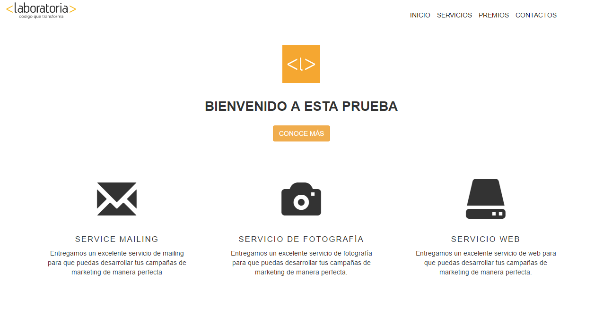

# Bootstrap - Frameworks

Ejercicio Guiado sobre el tema: "Introducción a Bootsrap".

## Descripción del proyecto

Uso de clases de Bootstrap para realizar página de entrada de Laboratoria. 

## Lanzamiento 

Esta es la versión final del ejercicio enunciado.

Hacer click aquí: <a href="https://naovillaj.github.io/Frameworks/">Grid System</a>

## Desarrollado con

Sublime

* Bootstrap 3
* [HTML5] - Para la estructura de la página web
* [CSS3] - Para darle el estilo a la página web

## Autores

* **Naomi Villanueva**
